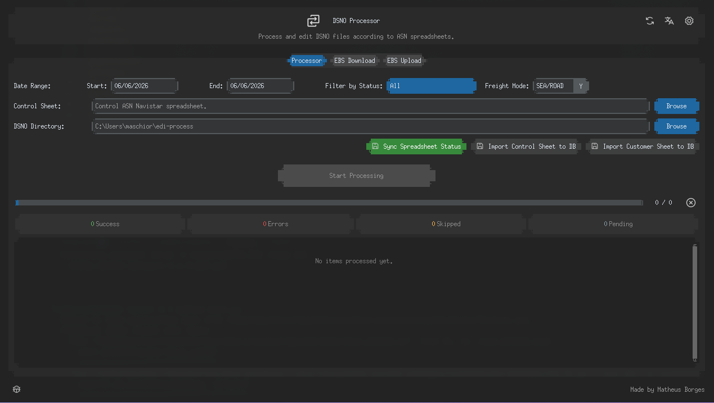

# DSNO Processor


**Windows**


**Linux**



> O **DSNO Processor** é uma aplicação desktop desenvolvida em Python para processamento em lote de arquivos DSNO contra planilhas de ASN. O sistema também integra automação web via Selenium para realizar downloads e uploads automáticos no sistema Oracle EBS.

## Utilização

Para utilizar o app, siga estas etapas:

Linux e macOS:

```bash
# Clone o repositório
git clone https://github.com/Maschior/dsno-processor.git
cd dsno-processor

# Crie e ative o ambiente virtual
python3 -m venv .venv
source .venv/bin/activate

# Instale as dependências
pip install -r requirements.txt

# Run
python main.py
```

Windows:

```cmd
# Clone o repositório
git clone https://github.com/Maschior/dsno-processor.git
cd dsno-processor

# Crie e ative o ambiente virtual
python -m venv .venv
.venv\Scripts\activate

# Instale as dependências
pip install -r requirements.txt

# Run
py main.py
```

### Executando testes unitários

Para rodar a suíte de testes do projeto com pytest (atualmente com **100% de sucesso / 208 testes passando**):

```bash
pytest tests/
```

### Compilando para Produção

Para gerar o executável standalone `.exe` no Windows:

1. Certifique-se de que o **Inno Setup 6** está instalado em sua máquina.
2. Execute o script de compilação:
```bash
python scripts/build_all.py
```

## Licença

Esse projeto está sob licença. Veja o arquivo de licença para mais detalhes.
